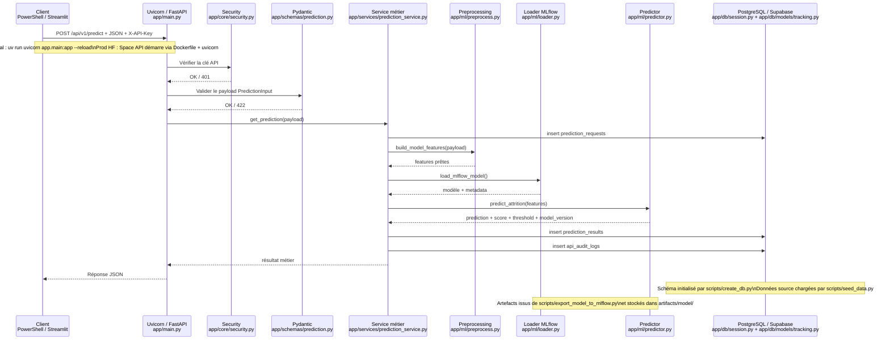
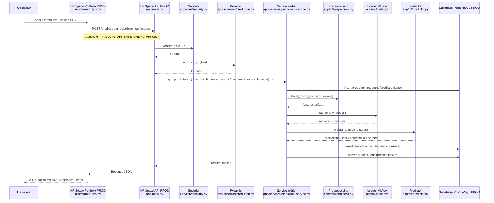

# Documentation de l'API

## 1. Rôle de l'API

L'API FastAPI constitue le point d'entrée unique du projet pour :

- valider les données métier envoyées par un client ;
- reconstruire les features attendues par le modèle final ;
- exécuter la prédiction, l'explication locale ou le batch ;
- tracer les appels unitaires en base ;
- exposer un contrat clair réutilisable par le portfolio Streamlit, les tests et un client externe.

Le code HTTP principal se trouve dans :

- [`app/api/v1/endpoints/predict.py`](../../app/api/v1/endpoints/predict.py)
- [`app/schemas/prediction.py`](../../app/schemas/prediction.py)
- [`app/services/prediction_service.py`](../../app/services/prediction_service.py)

## 2. Endpoints exposés

Les routes métier `POST` sont protégées par une clé d'API transmise dans l'en-tête `X-API-Key`.

### `GET /`

Route de présence minimale. Elle confirme que l'application FastAPI est démarrée.

### `GET /health`

Route de supervision simple.

Usage :

- vérifier que le service répond ;
- tester un déploiement local, Docker ou Hugging Face Spaces ;
- servir de point d'entrée à un contrôle de disponibilité.

### `POST /api/v1/predict`

Route de prédiction unitaire.

Sortie :

- `prediction` : classe finale, `0` ou `1` ;
- `score` : score brut du modèle ;
- `threshold` : seuil de décision du modèle ;
- `model_version` ;
- `model_name`.

Cette route écrit aussi en base :

- la requête reçue dans `prediction_requests` ;
- le résultat métier dans `prediction_results` ;
- un log technique dans `api_audit_logs`.

### `POST /api/v1/explain`

Route d'explication locale individuelle.

Elle reprend le même payload que `/predict`, mais renvoie une décomposition additive du score :

- `base_value` ;
- `positive_sum` ;
- `negative_sum` ;
- `top_positive` ;
- `top_negative`.

Cette route ne persiste pas d'enregistrement supplémentaire en base, car son objectif est l'analyse, pas la traçabilité métier.

### `POST /api/v1/predict/batch`

Route de scoring batch.

Entrée :

- une liste `rows` de payloads conformes à `PredictionInput`.

Sortie :

- une liste de résultats `PredictionOutput`.

Cette route ne persiste pas les appels en base. Elle sert à l'exploration, au portfolio Streamlit et aux démonstrations, sans polluer la traçabilité technique avec des traitements de masse.

## 3. Contrat d'entrée métier

Le contrat d'entrée est défini dans [`app/schemas/prediction.py`](../../app/schemas/prediction.py).

Principes importants :

- les entrées sont exprimées en français côté métier ;
- les valeurs catégorielles attendues correspondent aux CSV bruts du projet ;
- certains alias historiques ou formats compatibles restent acceptés pour ne pas casser d'anciens appels.

Exemples de valeurs attendues :

- `genre` : `Homme`, `Femme`
- `statut_marital` : `Celibataire`, `Marie(e)`, `Divorce(e)`
- `departement` : `Commercial`, `Consulting`, `Ressources Humaines`
- `frequence_deplacement` : `Aucun`, `Frequent`, `Occasionnel`
- `heure_supplementaires` : `Oui`, `Non`

## 4. Séquence technique détaillée

### 4.1 Prédiction unitaire : local ou runtime générique



Lecture :

- l'authentification est vérifiée avant toute logique métier ;
- la validation Pydantic arrête les payloads invalides avec `422` ;
- la persistance concerne seulement la prédiction unitaire ;
- le service métier orchestre preprocessing, chargement du modèle, scoring et audit.

### 4.2 Prédiction et usage en production HF



Ce schéma montre que le portfolio n'embarque ni le modèle ni le preprocessing : il délègue toute la logique à l'API.

## 5. Gestion de la base de données

### Local

En local, le projet est pensé pour fonctionner avec PostgreSQL via `P5_DATABASE_URL`.

Cette base sert à :

- la traçabilité des appels ;
- le stockage des données source dans `employees_source` ;
- les tests d'intégration autour du flux complet.

### Production / Hugging Face Spaces

La cible effectivement déployée est un PostgreSQL distant fourni via `P5_DATABASE_URL` et hébergé sur Supabase.

Points importants :

- en production, `P5_DATABASE_URL` et `P5_API_KEY` doivent être fournis explicitement ;
- SQLite n'est plus la cible normale d'exploitation ;
- un fallback SQLite ne reste acceptable que pour un runtime de démonstration non configuré.

## 6. Gestion des erreurs

Le comportement d'erreur suit la logique suivante :

- erreur de validation FastAPI : `422` ;
- erreur métier ou de validation complémentaire : `400` ;
- authentification absente ou invalide : `401` ;
- route inexistante : `404` ;
- méthode HTTP non supportée : `405` ;
- erreur interne : `500`.

Les tests fonctionnels couvrent explicitement `404`, `405`, `422` et le parcours nominal protégé par clé d'API.

## 7. Authentification et secrets

Le projet implémente une authentification simple par clé d'API.

Choix retenu :

- adapté à un projet pédagogique ;
- simple à déployer sur FastAPI et Hugging Face Spaces ;
- visible dans la documentation OpenAPI ;
- facile à tester automatiquement.

Bonnes pratiques :

- stocker `P5_API_KEY` en variable d'environnement ;
- utiliser les secrets GitHub pour piloter le déploiement ;
- définir aussi les secrets et variables runtime directement dans les Spaces Hugging Face ;
- ne jamais committer une vraie clé de production ;
- séparer autant que possible les secrets locaux, CI/CD et production.

## 8. Exemples d'utilisation

### Exemple de prédiction unitaire

```powershell
$payload = @{
    age = 35
    genre = "Homme"
    revenu_mensuel = 4500
    statut_marital = "Marie(e)"
    departement = "Consulting"
    poste = "Consultant"
    nombre_experiences_precedentes = 3
    annee_experience_totale = 12
    annees_dans_l_entreprise = 7
    annees_dans_le_poste_actuel = 4
    satisfaction_employee_environnement = 3
    note_evaluation_precedente = 3.0
    niveau_hierarchique_poste = 2
    satisfaction_employee_nature_travail = 4
    satisfaction_employee_equipe = 3
    satisfaction_employee_equilibre_pro_perso = 2
    note_evaluation_actuelle = 4.0
    heure_supplementaires = "Oui"
    augementation_salaire_precedente = 0.12
    nombre_participation_pee = 1
    nb_formations_suivies = 3
    nombre_employee_sous_responsabilite = 0
    distance_domicile_travail = 12
    niveau_education = 3
    domaine_etude = "Infra & Cloud"
    frequence_deplacement = "Occasionnel"
    annees_depuis_la_derniere_promotion = 2
    annes_sous_responsable_actuel = 3
} | ConvertTo-Json -Depth 5 -Compress

Invoke-RestMethod `
  -Method Post `
  -Uri "http://127.0.0.1:8000/api/v1/predict" `
  -Headers @{ "X-API-Key" = $env:P5_API_KEY } `
  -ContentType "application/json; charset=utf-8" `
  -Body ([System.Text.Encoding]::UTF8.GetBytes($payload))
```

### Exemple d'explication locale

```powershell
Invoke-RestMethod `
  -Method Post `
  -Uri "http://127.0.0.1:8000/api/v1/explain" `
  -Headers @{ "X-API-Key" = $env:P5_API_KEY } `
  -ContentType "application/json; charset=utf-8" `
  -Body ([System.Text.Encoding]::UTF8.GetBytes($payload))
```

### Exemple batch

```powershell
$batch = @{
    rows = @(
        (ConvertFrom-Json $payload)
    )
} | ConvertTo-Json -Depth 5 -Compress

Invoke-RestMethod `
  -Method Post `
  -Uri "http://127.0.0.1:8000/api/v1/predict/batch" `
  -Headers @{ "X-API-Key" = $env:P5_API_KEY } `
  -ContentType "application/json; charset=utf-8" `
  -Body ([System.Text.Encoding]::UTF8.GetBytes($batch))
```

## 9. Liens utiles

- Vue architecture : [`../architecture/overview.md`](../architecture/overview.md)
- Documentation BDD : [`../db/README.md`](../db/README.md)
- Preprocessing : [`../../app/ml/preprocess.py`](../../app/ml/preprocess.py)
- Chargement du modèle : [`../../app/ml/loader.py`](../../app/ml/loader.py)
- Scoring : [`../../app/ml/predictor.py`](../../app/ml/predictor.py)
