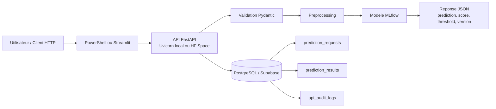
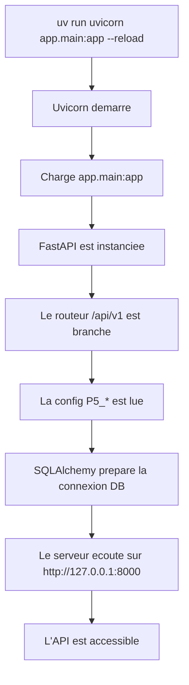
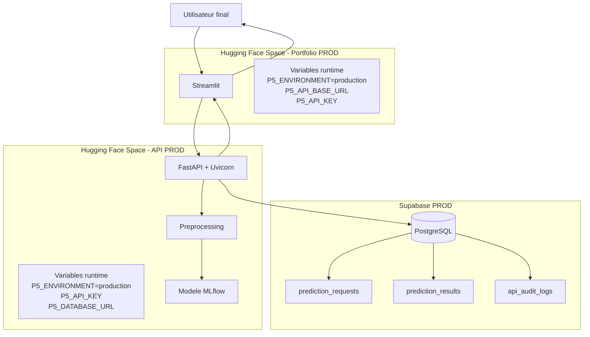
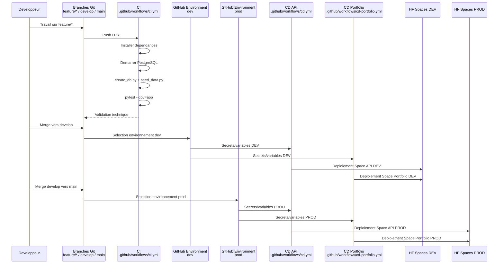

# Architecture du projet

## 1. Vue d'ensemble

Le projet suit une architecture en couches simple et explicite :

- `api` : gestion HTTP, routage et codes de réponse ;
- `schemas` : validation Pydantic des contrats d'entrée et de sortie ;
- `services` : orchestration métier ;
- `ml` : preprocessing, chargement du modèle, scoring et explication locale ;
- `db` : persistance SQLAlchemy et modèles ORM ;
- `scripts` : initialisation de base, seed et export MLflow ;
- `ui` : portfolio Streamlit ;
- `tests` : tests unitaires, d'intégration et fonctionnels.

Documents complémentaires :

- [Documentation API](../api/README.md)
- [Documentation de la base de données](../db/README.md)
- [Documentation du modèle](../model/README.md)

## 2. Flux fonctionnel principal

Le système complet peut être résumé ainsi :



Lecture :

- le client peut être un appel PowerShell, Swagger ou le portfolio Streamlit ;
- l'API centralise la validation, le preprocessing et le scoring ;
- la persistance est réservée aux prédictions unitaires métier ;
- la base conserve la requête brute, le résultat et l'audit technique.

## 3. Démarrage local de l'API

En local, l'application est démarrée par :

```powershell
uv run uvicorn app.main:app --reload
```

Le démarrage suit la séquence suivante :



Ce schéma explique le passage entre une simple commande de terminal et un service HTTP exploitable localement.

## 4. Architecture de production

La production actuellement déployée se compose de deux Spaces Hugging Face et d'une base PostgreSQL distante :



Points clés :

- le portfolio n'embarque pas le modèle ;
- le Space API porte toute la logique métier ;
- la base distante de référence en ligne est PostgreSQL via Supabase ;
- les variables runtime des Spaces HF sont distinctes des variables GitHub du pipeline.

## 5. Flux de prédiction détaillé

Le flux métier est le suivant :

1. le client appelle `POST /api/v1/predict` ;
2. `PredictionInput` valide le payload ;
3. `prediction_service.get_prediction()` enregistre la requête ;
4. `build_model_features()` reconstruit les features du modèle final ;
5. `load_mlflow_model()` charge le modèle et sa metadata ;
6. `predict_attrition()` calcule le score puis la classe finale ;
7. le résultat est persisté en base ;
8. un log technique est écrit dans `api_audit_logs` ;
9. l'API renvoie une `PredictionOutput`.

Le portfolio Streamlit ne recalcule jamais le modèle lui-même : il appelle l'API via `P5_API_BASE_URL`. Cela garantit que l'interface affiche exactement le comportement du service réel.

## 6. Données et persistance

Les tables métier du projet sont :

- `employees_source`
- `prediction_requests`
- `prediction_results`
- `api_audit_logs`

La logique de persistance est volontairement simple :

- une requête est créée en premier ;
- un résultat est créé si la prédiction unitaire aboutit ;
- un ou plusieurs logs techniques peuvent être associés à cette requête ;
- le batch et l'explication locale ne sont pas persistés, par choix d'architecture.

## 7. Environnements

Le projet formalise trois environnements :

- `development` pour le travail local ;
- `test` pour la CI et Pytest ;
- `production` pour les runtimes distants.

### Development

- cible recommandée : PostgreSQL local via Docker Compose ou Supabase DEV ;
- usage : développement, démonstration, seed et vérification SQL ;
- configuration attendue : `P5_ENVIRONMENT=development`.

### Test

- cible recommandée : PostgreSQL du job GitHub Actions pour les scripts, plus SQLite mémoire dans certains tests rapides ;
- usage : exécution automatisée du pipeline ;
- configuration attendue : `P5_ENVIRONMENT=test`.

### Production

- cible recommandée : PostgreSQL distant fourni via `P5_DATABASE_URL` ;
- usage : runtime du Space API et environnement démontrable ;
- configuration attendue : `P5_ENVIRONMENT=production`.

Points importants :

- en production, `P5_DATABASE_URL` et `P5_API_KEY` sont obligatoires ;
- SQLite n'est plus la cible normale d'exploitation ;
- il ne reste qu'un filet de sécurité si aucun PostgreSQL distant n'est fourni.

## 8. Pipeline CI/CD

Le pipeline est maintenant clairement séparé :

- `ci.yml` valide le code ;
- `cd.yml` déploie l'API ;
- `cd-portfolio.yml` déploie le portfolio.



Lecture :

- `feature/*` sert à la construction et aux PR ;
- `develop` valide l'environnement DEV ;
- `main` publie l'environnement PROD ;
- les workflows CD consomment les variables/secrets des environnements GitHub `dev` et `prod`.

## 9. Choix d'architecture

Cette architecture a été retenue pour :

- garder une séparation claire des responsabilités ;
- faciliter les tests ;
- éviter de dupliquer la logique du modèle entre backend et frontend ;
- garder une base de référence locale solide tout en supportant un déploiement distant propre.

## 10. Réponse au besoin analytique du P5

L'architecture actuelle répond au besoin analytique du projet P5 car elle couvre un cycle complet :

- préparation et seed des données source ;
- prédiction unitaire ;
- analyse batch ;
- explication locale ;
- persistance des appels unitaires ;
- visualisation via le portfolio Streamlit.

Les prolongements naturels, si le projet devait aller plus loin, seraient :

- l'historisation analytique des batchs ;
- des KPI RH agrégés ;
- une rétention/purge structurée des logs ;
- des migrations versionnées avec Alembic.
