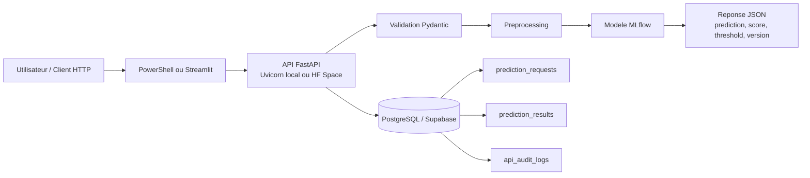
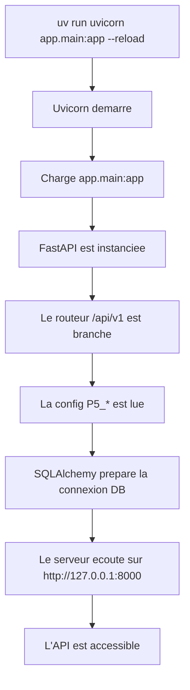
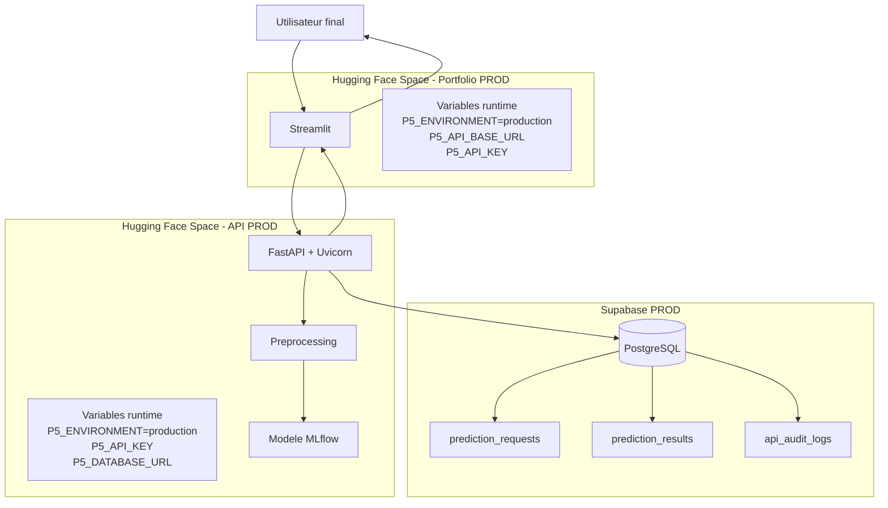
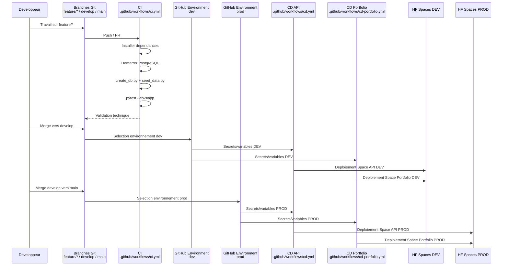

# Architecture du projet

## 1. Vue d'ensemble

Le projet suit une architecture en couches simple et explicite :

- `api` : gestion HTTP, routage et codes de reponse ;
- `schemas` : validation Pydantic des contrats d'entree et de sortie ;
- `services` : orchestration metier ;
- `ml` : preprocessing, chargement du modele, scoring et explication locale ;
- `db` : persistance SQLAlchemy et modeles ORM ;
- `scripts` : initialisation de base, seed et export MLflow ;
- `ui` : portfolio Streamlit ;
- `tests` : tests unitaires, d'integration et fonctionnels.

Documents complementaires :

- [Documentation API](../api/README.md)
- [Documentation de la base de donnees](../db/README.md)
- [Documentation du modele](../model/README.md)

## 2. Flux fonctionnel principal

Le systeme complet peut etre resume ainsi :



Lecture :

- le client peut etre un appel PowerShell, Swagger ou le portfolio Streamlit ;
- l'API centralise la validation, le preprocessing et le scoring ;
- la persistance est reservee aux predictions unitaires metier ;
- la base conserve la requete brute, le resultat et l'audit technique.

## 3. Demarrage local de l'API

En local, l'application est demarree par :

```powershell
uv run uvicorn app.main:app --reload
```

Le demarrage suit la sequence suivante :



Ce schema explique le passage entre une simple commande de terminal et un service HTTP exploitable localement.

## 4. Architecture de production

La production actuellement deployee se compose de deux Spaces Hugging Face et d'une base PostgreSQL distante :



Points clefs :

- le portfolio n'embarque pas le modele ;
- le Space API porte toute la logique metier ;
- la base distante de reference en ligne est PostgreSQL via Supabase ;
- les variables runtime des Spaces HF sont distinctes des variables GitHub du pipeline.

## 5. Flux de prediction detaille

Le flux metier est le suivant :

1. le client appelle `POST /api/v1/predict` ;
2. `PredictionInput` valide le payload ;
3. `prediction_service.get_prediction()` enregistre la requete ;
4. `build_model_features()` reconstruit les features du modele final ;
5. `load_mlflow_model()` charge le modele et sa metadata ;
6. `predict_attrition()` calcule le score puis la classe finale ;
7. le resultat est persiste en base ;
8. un log technique est ecrit dans `api_audit_logs` ;
9. l'API renvoie une `PredictionOutput`.

Le portfolio Streamlit ne recalcule jamais le modele lui-meme : il appelle l'API via `P5_API_BASE_URL`. Cela garantit que l'interface affiche exactement le comportement du service reel.

## 6. Donnees et persistance

Les tables metier du projet sont :

- `employees_source`
- `prediction_requests`
- `prediction_results`
- `api_audit_logs`

La logique de persistance est volontairement simple :

- une requete est creee en premier ;
- un resultat est cree si la prediction unitaire aboutit ;
- un ou plusieurs logs techniques peuvent etre associes a cette requete ;
- le batch et l'explication locale ne sont pas persistes, par choix d'architecture.

## 7. Environnements

Le projet formalise trois environnements :

- `development` pour le travail local ;
- `test` pour la CI et Pytest ;
- `production` pour les runtimes distants.

### Development

- cible recommandee : PostgreSQL local via Docker Compose ou Supabase DEV ;
- usage : developpement, demonstration, seed et verification SQL ;
- configuration attendue : `P5_ENVIRONMENT=development`.

### Test

- cible recommandee : PostgreSQL du job GitHub Actions pour les scripts, plus SQLite memoire dans certains tests rapides ;
- usage : execution automatisee du pipeline ;
- configuration attendue : `P5_ENVIRONMENT=test`.

### Production

- cible recommandee : PostgreSQL distant fourni via `P5_DATABASE_URL` ;
- usage : runtime du Space API et environnement demonstrable ;
- configuration attendue : `P5_ENVIRONMENT=production`.

Points importants :

- en production, `P5_DATABASE_URL` et `P5_API_KEY` sont obligatoires ;
- SQLite n'est plus la cible normale d'exploitation ;
- il ne reste qu'un filet de securite si aucun PostgreSQL distant n'est fourni.

## 8. Pipeline CI/CD

Le pipeline est maintenant clairement separe :

- `ci.yml` valide le code ;
- `cd.yml` deploie l'API ;
- `cd-portfolio.yml` deploie le portfolio.



Lecture :

- `feature/*` sert a la construction et aux PR ;
- `develop` valide l'environnement DEV ;
- `main` publie l'environnement PROD ;
- les workflows CD consomment les variables/secrets des environnements GitHub `dev` et `prod`.

## 9. Choix d'architecture

Cette architecture a ete retenue pour :

- garder une separation claire des responsabilites ;
- faciliter les tests ;
- eviter de dupliquer la logique du modele entre backend et frontend ;
- garder une base de reference locale solide tout en supportant un deploiement distant propre.

## 10. Reponse au besoin analytique du P5

L'architecture actuelle repond au besoin analytique du projet P5 car elle couvre un cycle complet :

- preparation et seed des donnees source ;
- prediction unitaire ;
- analyse batch ;
- explication locale ;
- persistance des appels unitaires ;
- visualisation via le portfolio Streamlit.

Les prolongements naturels, si le projet devait aller plus loin, seraient :

- l'historisation analytique des batchs ;
- des KPI RH agreges ;
- une retention/purge structuree des logs ;
- des migrations versionnees avec Alembic.
