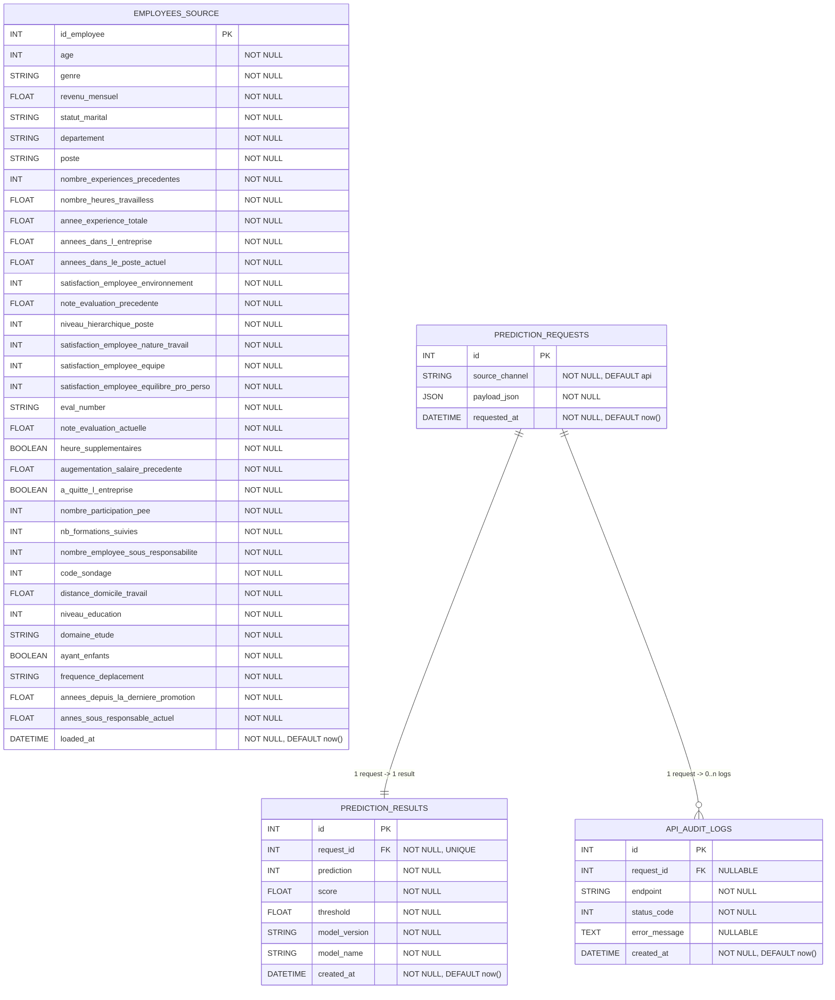

# Documentation de la base de donnees

## 1. Role de la base dans le projet

La base de donnees remplit deux fonctions distinctes :

- stocker les donnees source fusionnees du projet dans `employees_source` ;
- tracer le fonctionnement applicatif de l'API via les tables de requetes, de resultats et de logs techniques.

Dans le cadre du P5, la base n'est donc pas un simple support de persistance : elle permet aussi d'auditer les appels au modele et de demontrer l'integration d'un moteur ML dans un flux applicatif complet.

## 2. Technologies utilisees

Le projet utilise :

- SQLAlchemy comme couche ORM ;
- PostgreSQL comme base de reference en local ;
- PostgreSQL distant via Supabase comme cible deployee pour les Spaces Hugging Face ;
- SQLite seulement comme fallback de secours si aucun `P5_DATABASE_URL` n'est fourni.

Les modeles ORM se trouvent dans :

- [`app/db/models/tracking.py`](../../app/db/models/tracking.py)

L'initialisation du schema est realisee par :

- [`scripts/create_db.py`](../../scripts/create_db.py)

Le chargement des donnees sources est realise par :

- [`scripts/seed_data.py`](../../scripts/seed_data.py)

## 3. Schema logique

Le schema relationnel du projet est le suivant :



Legende :

- `PK` : cle primaire ;
- `FK` : cle etrangere ;
- `UNIQUE` : contrainte d'unicite ;
- `NOT NULL` : champ obligatoire ;
- `DEFAULT now()` : horodatage automatique.

## 4. Description des tables

### 4.1 `employees_source`

Cette table stocke une vue fusionnee des trois jeux de donnees bruts du projet.

Cle principale :

- `id_employee`

Role :

- servir de base de demonstration et de verification ;
- fournir un jeu de donnees consolide pour les scripts et les controles SQL ;
- materialiser l'integration des donnees metier dans l'application.

### 4.2 `prediction_requests`

Cette table stocke la requete brute recue par l'API avant scoring.

Cle principale :

- `id`

Colonnes principales :

- `source_channel` : canal d'origine, par defaut `api` ;
- `payload_json` : payload brut recu ;
- `requested_at` : horodatage de la requete.

Role :

- conserver exactement ce qui a ete demande au service ;
- servir de point d'ancrage relationnel pour les resultats et les logs.

### 4.3 `prediction_results`

Cette table stocke la sortie du modele pour une requete unitaire.

Cle principale :

- `id`

Cle etrangere :

- `request_id` -> `prediction_requests.id`

Colonnes principales :

- `prediction`
- `score`
- `threshold`
- `model_version`
- `model_name`
- `created_at`

Role :

- tracer le resultat metier effectivement renvoye ;
- relier une entree API a la sortie du modele ;
- conserver la version du modele utilisee lors du scoring.

### 4.4 `api_audit_logs`

Cette table stocke les evenements techniques lies a l'execution de l'API.

Cle principale :

- `id`

Cle etrangere optionnelle :

- `request_id` -> `prediction_requests.id`

Colonnes principales :

- `endpoint`
- `status_code`
- `error_message`
- `created_at`

Role :

- tracer les appels meme en cas d'echec partiel ;
- conserver les erreurs techniques eventuelles ;
- separer l'audit technique de la donnee metier.

## 5. Relations et contraintes

### `prediction_requests` -> `prediction_results`

Relation :

- `1 -> 1`

Justification :

- une requete unitaire persistée ne doit produire qu'un seul resultat metier final ;
- cette contrainte est materialisee par `request_id` avec unicite dans `prediction_results`.

### `prediction_requests` -> `api_audit_logs`

Relation :

- `1 -> N`

Justification :

- une meme requete peut donner lieu a plusieurs evenements techniques au cours de sa vie ;
- la table de logs est volontairement plus souple que la table metier.

### `employees_source`

Relation :

- aucune relation directe avec les tables de scoring

Justification :

- cette table represente les donnees source consolidees ;
- elle n'est pas necessaire au runtime du modele dans les deploiements distants ;
- elle reste utile en local pour l'exploitation, le controle SQL et les demonstrations.

### Contraintes explicites du schema

Le schema materialise deja :

- les cles primaires ;
- les cles etrangeres ;
- l'unicite du lien requete -> resultat ;
- les horodatages par defaut ;
- les non-nullites utiles au flux applicatif ;
- des index explicites sur :
  - `prediction_requests.requested_at`
  - `prediction_results.created_at`
  - `api_audit_logs.created_at`
  - `api_audit_logs.status_code`

Montees en gamme naturelles :

- quelques `CHECK` constraints metier ;
- des migrations versionnees avec Alembic.

## 6. Creation et alimentation de la base

### Creation du schema

Le schema est cree via :

```powershell
uv run python scripts/create_db.py
```

Le script s'appuie sur `Base.metadata.create_all(...)` pour materialiser toutes les tables ORM.

Il cree aussi explicitement les index declares dans les modeles avec
`checkfirst=True`, ce qui permet de rattraper un ajout d'index sur une base
deja existante sans migration complete.

### Chargement des donnees source

Les donnees source sont chargees via :

```powershell
uv run python scripts/seed_data.py
```

Le script :

- lit les fichiers presents dans `data/raw/` ;
- fusionne les extraits metier ;
- vide puis recharge `employees_source`.

## 7. Local vs deploiement distant

### Local

- PostgreSQL est la base recommandee ;
- elle permet une demonstration complete du schema, du seed et de la tracabilite ;
- elle constitue la reference technique du projet.

### Hugging Face Spaces

- la cible deployee est PostgreSQL via Supabase ;
- le Space API doit recevoir `P5_DATABASE_URL` et `P5_API_KEY` ;
- le portfolio n'accede jamais directement a la base.

Important :

- le preprocessing du modele ne depend plus de la base au runtime ;
- les references necessaires au feature engineering sont embarquees dans `artifacts/model/preprocessing_reference.json`.

## 8. Gestion du volume

Le projet ne vise pas un tres gros volume au sens industriel, mais plusieurs choix sont deja coherents :

- separation entre donnees source et tables de tracabilite ;
- absence de persistance massive pour `/predict/batch` ;
- stockage du payload brut en JSON dans `prediction_requests` ;
- schema compact et relisibile pour les tests et la demonstration ;
- indexation explicite des horodatages et du `status_code` pour accelerer les lectures d'audit et les requetes recentes.

Regle de retention retenue pour le projet :

- les logs techniques de `api_audit_logs` ont vocation a etre conserves 90 jours glissants, puis archives ou purges par une tache de maintenance planifiee si le volume augmente.

Si le volume augmentait, les pistes naturelles seraient :

- retention/purge des logs techniques ;
- migrations versionnees ;
- separation plus nette entre base operationnelle et base analytique.

## 9. Fichiers utiles

- Modeles ORM : [`../../app/db/models/tracking.py`](../../app/db/models/tracking.py)
- Session SQLAlchemy : [`../../app/db/session.py`](../../app/db/session.py)
- Creation du schema : [`../../scripts/create_db.py`](../../scripts/create_db.py)
- Seed : [`../../scripts/seed_data.py`](../../scripts/seed_data.py)
- Documentation architecture : [`../architecture/overview.md`](../architecture/overview.md)

## 10. Positionnement par rapport au besoin analytique

Le projet couvre un premier niveau solide de besoin analytique :

- ingestion et fusion des donnees brutes ;
- stockage structure des donnees source dans `employees_source` ;
- tracabilite des appels unitaires au modele ;
- restitution des resultats de prediction ;
- logs techniques pour l'audit applicatif ;
- analyse batch dans le portfolio Streamlit ;
- selection d'un individu apres scoring global pour une lecture locale plus fine.

Le systeme ne pretend pas constituer une plateforme BI complete, mais il met deja en place un cycle coherent de preparation, stockage, exploitation et visualisation des donnees autour du service de prediction.
