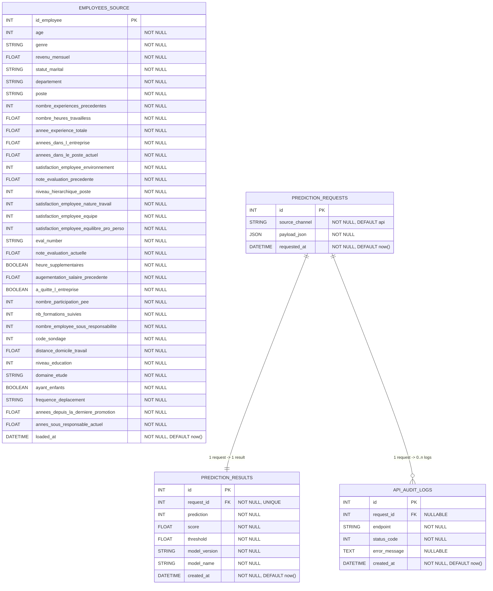

# Documentation de la base de donnees

## 1. Role de la base

La base de donnees remplit deux fonctions :

- stocker les donnees source fusionnees du projet dans `employees_source` ;
- tracer les predictions unitaires de l'API via :
  - `prediction_requests`
  - `prediction_results`
  - `api_audit_logs`

Dans le cadre du P5, elle ne sert donc pas seulement a persister des lignes : elle permet aussi de demontrer la traçabilite applicative du service ML.

## 2. Technologie retenue

Le projet utilise :

- SQLAlchemy comme couche ORM ;
- PostgreSQL comme base de reference en local ;
- PostgreSQL distant via `P5_DATABASE_URL` pour le deploiement ;
- SQLite uniquement comme fallback de secours si aucun PostgreSQL n'est configure.

Fichiers principaux :

- modeles ORM : [`../../app/db/models/tracking.py`](../../app/db/models/tracking.py)
- session SQLAlchemy : [`../../app/db/session.py`](../../app/db/session.py)
- creation du schema : [`../../scripts/create_db.py`](../../scripts/create_db.py)
- seed : [`../../scripts/seed_data.py`](../../scripts/seed_data.py)

## 3. Modele de donnees



Legende :

- `PK` : cle primaire
- `FK` : cle etrangere
- `UNIQUE` : contrainte d'unicite
- `NOT NULL` : champ obligatoire
- `DEFAULT now()` : horodatage automatique

## 4. Tables principales

### `employees_source`

Table source consolidee issue de la fusion des trois CSV metier.

Role :

- servir de reference locale ;
- prouver l'integration des donnees ;
- permettre les verifications SQL et les demonstrations.

### `prediction_requests`

Conserve la requete brute recue par l'API.

Champs clefs :

- `source_channel`
- `payload_json`
- `requested_at`

### `prediction_results`

Conserve le resultat metier renvoye par le modele pour une requete unitaire.

Champs clefs :

- `request_id`
- `prediction`
- `score`
- `threshold`
- `model_name`
- `model_version`

Point important :

- `request_id` est `UNIQUE`, ce qui force une relation `1 -> 1` entre requete et resultat.

### `api_audit_logs`

Conserve les evenements techniques lies a l'execution de l'API.

Champs clefs :

- `request_id`
- `endpoint`
- `status_code`
- `error_message`
- `created_at`

Point important :

- `request_id` est nullable pour laisser un peu de souplesse au logging technique.

## 5. Contraintes actuellement presentes

Le schema materialise deja :

- les cles primaires ;
- les cles etrangeres ;
- l'unicite du lien `request -> result` ;
- les `NOT NULL` utiles au flux applicatif ;
- les horodatages par defaut.

En revanche, a ce stade :

- il n'y a pas encore de `CHECK constraints` metier ;
- il n'y a pas encore de migrations Alembic ;
- la politique de retention des logs n'est pas automatisee.

## 6. Creation du schema

Commande :

```powershell
uv run python scripts/create_db.py
```

Le script charge la metadata SQLAlchemy et cree les tables declarees dans les modeles ORM.

## 7. Seed des donnees source

Commande :

```powershell
uv run python scripts/seed_data.py
```

Le script :

- charge `extrait_sirh.csv`
- charge `extrait_eval.csv`
- charge `extrait_sondage.csv`
- verifie la cardinalite
- fusionne les trois sources
- normalise booleens et pourcentages
- vide puis recharge `employees_source`

Etat attendu :

- `1470` lignes inserees

## 8. Exemples d'entrees

### Exemple `prediction_requests`

```json
{
  "age": 35,
  "genre": "Homme",
  "revenu_mensuel": 4500,
  "statut_marital": "Marie(e)",
  "departement": "Consulting",
  "poste": "Consultant"
}
```

### Exemple `prediction_results`

```json
{
  "prediction": 0,
  "score": -18.58866414724979,
  "threshold": 0.1138,
  "model_name": "linear_svc_attrition",
  "model_version": "0.1.0"
}
```

### Exemple `api_audit_logs`

```json
{
  "endpoint": "/api/v1/predict",
  "status_code": 200,
  "error_message": null
}
```

## 9. Requetes SQL utiles

### Compter les lignes de la table source

```sql
SELECT COUNT(*) AS nb_employees_source
FROM employees_source;
```

### Verifier la traçabilite unitaire

```sql
SELECT
    pr.id AS request_id,
    pr.requested_at,
    pr.payload_json->>'genre' AS genre,
    pr.payload_json->>'departement' AS departement,
    pr.payload_json->>'poste' AS poste,
    res.prediction,
    ROUND(CAST(res.score AS numeric), 4) AS score,
    ROUND(CAST(res.threshold AS numeric), 4) AS threshold,
    res.model_name,
    res.model_version,
    log.status_code
FROM prediction_requests pr
LEFT JOIN prediction_results res
    ON res.request_id = pr.id
LEFT JOIN api_audit_logs log
    ON log.request_id = pr.id
ORDER BY pr.id DESC
LIMIT 10;
```

## 10. Local vs deploiement distant

### Local

- PostgreSQL est la base recommandee ;
- elle permet de montrer le schema, le seed et la traçabilite ;
- elle reste la reference technique du projet.

### Deploiement distant

- le Space API utilise un PostgreSQL distant via `P5_DATABASE_URL` ;
- le portfolio n'accede jamais directement a la base ;
- SQLite n'est pas la cible normale d'exploitation.

Point important :

- le preprocessing du modele ne depend plus de la base au runtime ;
- les references necessaires a l'inference sont embarquees dans les artefacts du modele.

## 11. Positionnement par rapport au besoin analytique

Le projet couvre deja un premier niveau coherent de besoin analytique :

- integration et stockage des donnees source ;
- prediction unitaire traçable ;
- analyse batch dans le portfolio ;
- lecture individuelle d'un employe apres scoring global.

Le systeme ne pretend pas etre une plateforme BI complete, mais il met en place un cycle propre de preparation, stockage, exploitation et visualisation des donnees autour du service de prediction.
