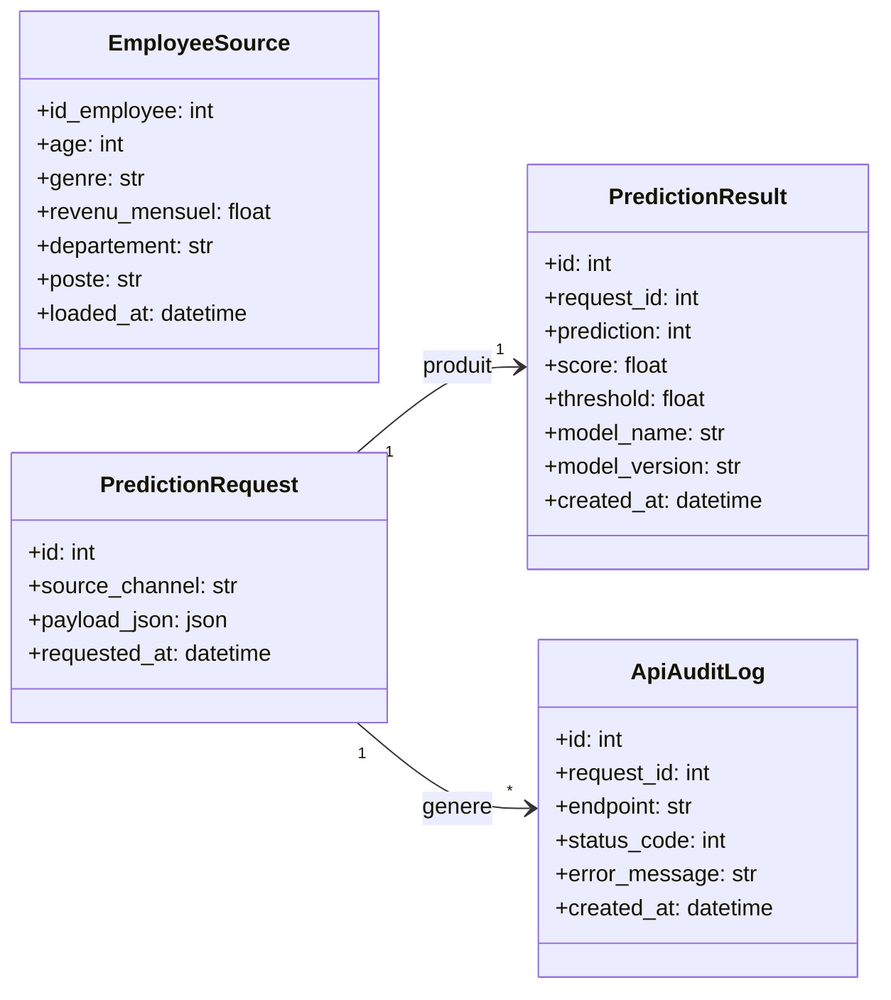

# Documentation de la base de données

## 1. Rôle de la base dans le projet

La base de données remplit deux fonctions distinctes :

- stocker les données source fusionnées du projet dans `employees_source` ;
- tracer le fonctionnement applicatif de l'API via les tables de requêtes, de résultats et de logs techniques.

Dans le cadre du P5, la base n'est donc pas un simple support de persistance : elle permet aussi d'auditer les appels au modèle et de démontrer l'intégration d'un moteur ML dans un flux applicatif complet.

## 2. Technologies utilisées

Le projet utilise :

- SQLAlchemy comme couche ORM ;
- PostgreSQL comme base de référence en local et comme cible recommandée en production ;
- SQLite seulement comme fallback de secours pour un runtime de démonstration non configuré avec `P5_DATABASE_URL`.

Les modèles ORM se trouvent dans :

- [`app/db/models/tracking.py`](../../app/db/models/tracking.py)

L'initialisation du schéma est réalisée par :

- [`scripts/create_db.py`](../../scripts/create_db.py)

Le chargement des données sources est réalisé par :

- [`scripts/seed_data.py`](../../scripts/seed_data.py)

## 3. Vue d'ensemble du schéma

Le schéma logique du projet peut être résumé ainsi :

```text
employees_source

prediction_requests 1 ----- 1 prediction_results
prediction_requests 1 ----- N api_audit_logs
```

## 3.1 Schéma UML simplifié



Interprétation :

- `employees_source` contient les données RH consolidées et ne dépend pas des tables de traçabilité ;
- `prediction_requests` représente chaque appel unitaire enregistré par l'API ;
- `prediction_results` stocke la sortie du modèle pour une requête donnée ;
- `api_audit_logs` conserve les événements techniques associés aux appels API.

## 4. Description détaillée des tables

### 4.1 `employees_source`

Cette table stocke une vue fusionnée des trois jeux de données bruts du projet.

Clé principale :

- `id_employee`

Exemples de colonnes :

- variables d'identité et de contexte : `age`, `genre`, `statut_marital`, `departement`, `poste` ;
- variables RH et performance : `revenu_mensuel`, `niveau_hierarchique_poste`, `annee_experience_totale` ;
- variables de satisfaction : `satisfaction_employee_environnement`, `satisfaction_employee_equipe` ;
- variables de mobilité et d'historique : `frequence_deplacement`, `annees_depuis_la_derniere_promotion` ;
- métadonnée de chargement : `loaded_at`.

Rôle :

- servir de base de démonstration et de vérification ;
- fournir un jeu de données consolidé pour les scripts et les contrôles SQL ;
- matérialiser l'intégration des données métier dans l'application.

### 4.2 `prediction_requests`

Cette table stocke la requête brute reçue par l'API avant scoring.

Clé principale :

- `id`

Colonnes principales :

- `source_channel` : canal d'origine, par défaut `api` ;
- `payload_json` : payload brut reçu ;
- `requested_at` : horodatage de la requête.

Rôle :

- conserver exactement ce qui a été demandé au service ;
- servir de point d'ancrage relationnel pour les résultats et les logs.

### 4.3 `prediction_results`

Cette table stocke la sortie du modèle pour une requête unitaire.

Clé principale :

- `id`

Clé étrangère :

- `request_id` -> `prediction_requests.id`

Colonnes principales :

- `prediction`
- `score`
- `threshold`
- `model_version`
- `model_name`
- `created_at`

Rôle :

- tracer le résultat métier effectivement renvoyé ;
- relier une entrée API à la sortie du modèle ;
- conserver la version du modèle utilisée lors du scoring.

### 4.4 `api_audit_logs`

Cette table stocke les événements techniques liés à l'exécution de l'API.

Clé principale :

- `id`

Clé étrangère optionnelle :

- `request_id` -> `prediction_requests.id`

Colonnes principales :

- `endpoint`
- `status_code`
- `error_message`
- `created_at`

Rôle :

- tracer les appels même en cas d'échec partiel ;
- conserver les erreurs techniques éventuelles ;
- séparer l'audit technique de la donnée métier.

## 5. Relations entre les tables

### `prediction_requests` -> `prediction_results`

Relation :

- `1 -> 1`

Justification :

- une requête unitaire persistée ne doit produire qu'un seul résultat métier final ;
- cette contrainte est matérialisée par `request_id` avec unicité dans `prediction_results`.

### `prediction_requests` -> `api_audit_logs`

Relation :

- `1 -> N`

Justification :

- une même requête peut donner lieu à plusieurs événements techniques au cours de sa vie ;
- la table de logs est volontairement plus souple que la table métier.

### `employees_source`

Relation :

- aucune relation directe avec les tables de scoring

Justification :

- cette table représente les données source consolidées ;
- elle n'est pas nécessaire au runtime du modèle dans les déploiements distants ;
- elle reste utile en local pour l'exploitation, le contrôle SQL et les démonstrations.

## 6. Contraintes et règles de cohérence

Le schéma applique plusieurs contraintes simples mais importantes.

### Clés primaires

- chaque table possède une clé primaire entière ;
- `employees_source` utilise `id_employee` comme identifiant métier principal.

### Clés étrangères

- `prediction_results.request_id` référence `prediction_requests.id` ;
- `api_audit_logs.request_id` référence `prediction_requests.id`.

### Unicité

- `prediction_results.request_id` est unique, ce qui force une relation `1 -> 1` entre requête et résultat.

### Non-nullité

Les colonnes essentielles au fonctionnement sont déclarées `nullable=False`, notamment :

- les informations métier nécessaires au scoring dans `employees_source` ;
- le payload brut dans `prediction_requests` ;
- les champs structurants du résultat dans `prediction_results` ;
- l'endpoint et le code HTTP dans `api_audit_logs`.

### Contraintes actuellement explicites

Le projet matérialise déjà :

- les clés primaires ;
- les clés étrangères ;
- l'unicité du lien requête -> résultat ;
- les horodatages par défaut ;
- les non-nullités utiles au flux applicatif.

Une montée en gamme possible serait d'ajouter plus tard :

- des index complémentaires sur les tables de traçabilité ;
- quelques `CHECK` constraints métier ;
- des migrations versionnées avec Alembic.

### Horodatage

Les tables principales disposent d'un horodatage par défaut (`server_default=func.now()`), ce qui facilite :

- l'audit ;
- la reconstitution d'une chronologie ;
- le contrôle du bon fonctionnement du service.

## 7. Création et alimentation de la base

### Création du schéma

Le schéma est créé via :

```powershell
uv run python scripts/create_db.py
```

Le script s'appuie sur `Base.metadata.create_all(...)` pour matérialiser toutes les tables ORM.

### Chargement des données source

Les données source sont chargées via :

```powershell
uv run python scripts/seed_data.py
```

Le script :

- lit les fichiers présents dans `data/raw/` ;
- fusionne les extraits métier ;
- vide puis recharge `employees_source`.

## 8. Gestion du volume des données

Le projet ne vise pas un très gros volume au sens industriel, mais il met déjà en place des choix cohérents pour gérer efficacement la donnée traitée.

### 8.1 Séparation entre données source et traçabilité

Les données source (`employees_source`) sont séparées des données de traçabilité (`prediction_requests`, `prediction_results`, `api_audit_logs`).

Avantage :

- on évite de mélanger les données RH de référence avec les appels techniques du service ;
- les usages SQL restent plus lisibles ;
- les purges futures peuvent être ciblées table par table.

### 8.2 Pas de persistance massive pour le batch

La route `/api/v1/predict/batch` ne persiste pas les traitements en base.

Avantage :

- on évite d'exploser artificiellement le volume de logs avec des traitements de démonstration ou d'exploration ;
- la base reste concentrée sur la traçabilité utile des appels unitaires métier.

### 8.3 Payload brut stocké en JSON

Le choix du champ `payload_json` dans `prediction_requests` permet :

- de conserver exactement l'entrée reçue ;
- d'éviter de dupliquer toute la structure métier dans une table relationnelle dédiée ;
- de garder une traçabilité souple sans multiplier les colonnes techniques.

### 8.4 Schéma simple et lisible

Le schéma reste volontairement compact :

- peu de tables ;
- relations explicites ;
- absence de jointures complexes inutiles ;
- création rapide du schéma pour les tests et les démonstrations.

Ce choix est adapté au périmètre du P5 et facilite :

- la maintenance ;
- les tests automatisés ;
- le redémarrage rapide d'un environnement local.

### 8.5 Perspectives si le volume augmentait

Si le projet devait évoluer vers un volume plus important, les pistes naturelles seraient :

- indexation complémentaire selon les besoins de consultation ;
- politique d'archivage ou purge des logs techniques ;
- migrations versionnées avec Alembic ;
- séparation plus nette entre base opérationnelle et base analytique.

## 9. Local vs Hugging Face Spaces

### Local

- PostgreSQL est la base recommandée ;
- elle permet une démonstration complète du schéma, du seed et de la traçabilité ;
- elle constitue la référence technique du projet.

### Hugging Face Spaces

- la cible recommandée est un PostgreSQL distant fourni via `P5_DATABASE_URL` ;
- SQLite ne reste qu'un filet de sécurité éventuel pour un runtime de démonstration non configuré ;
- dans une configuration de production propre, le Space API doit recevoir sa chaîne PostgreSQL et ne pas s'appuyer sur SQLite.

Important :

- le preprocessing du modèle ne dépend plus de la base au runtime ;
- les références nécessaires au feature engineering sont embarquées dans `artifacts/model/preprocessing_reference.json`.

## 10. Fichiers utiles

- Modèles ORM : [`../../app/db/models/tracking.py`](../../app/db/models/tracking.py)
- Session SQLAlchemy : [`../../app/db/session.py`](../../app/db/session.py)
- Création du schéma : [`../../scripts/create_db.py`](../../scripts/create_db.py)
- Seed : [`../../scripts/seed_data.py`](../../scripts/seed_data.py)
- Documentation architecture : [`../architecture/overview.md`](../architecture/overview.md)

## 11. Positionnement par rapport au besoin analytique

À ce stade, le projet formalise bien les processus de traitement et de stockage des données nécessaires au périmètre du P5.

Ce qui est effectivement couvert :

- ingestion et fusion des données brutes via le script de seed ;
- stockage structuré des données source dans `employees_source` ;
- traçabilité des appels unitaires au modèle ;
- restitution des résultats de prédiction ;
- logs techniques pour l'audit applicatif ;
- analyse batch dans le portfolio Streamlit ;
- sélection d'un individu après scoring global pour une lecture locale plus fine.

À notre sens, cet ensemble répond au besoin du projet P5, car il ne se limite pas à exposer un modèle : il met en place un cycle cohérent de préparation, stockage, exploitation et visualisation des données autour du service de prédiction.

Il est donc raisonnable d'affirmer que le projet couvre un premier niveau de besoin analytique, au sens où il permet :

- d'explorer un jeu de données d'employés ;
- de scorer un ensemble d'individus ;
- de visualiser les résultats globaux ;
- d'analyser ensuite un cas particulier plus en détail.

## 12. Limites actuelles et pistes d'amélioration

Le projet ne prétend toutefois pas constituer un système analytique complet au sens d'une plateforme BI industrialisée.

Limites actuelles :

- absence d'historisation analytique avancée des batchs ;
- absence de table d'agrégats métier dédiée ;
- absence de tableaux de bord décisionnels multi-indicateurs sur longue période ;
- absence de stratégie de volumétrie avancée au-delà du périmètre pédagogique ;
- dépendance à une base distante à configurer explicitement en production.

Pistes d'amélioration si le projet devait être prolongé :

- persister les batchs dans une table dédiée avec métadonnées d'exécution ;
- historiser les résultats par campagne ou par date d'analyse ;
- ajouter des vues ou tables d'agrégats pour des KPI RH ;
- brancher une vraie base distante durable pour les déploiements cloud ;
- connecter un outil de BI ou enrichir le portfolio avec des indicateurs de synthèse plus décisionnels ;
- mettre en place des migrations versionnées et une stratégie de rétention des logs.
